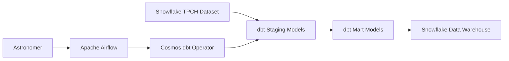
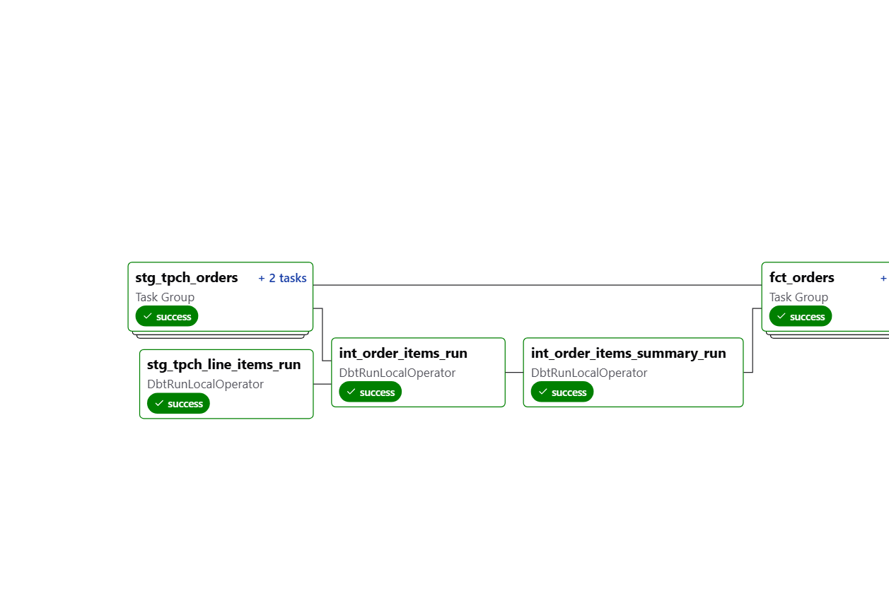

# dbt + Airflow + Snowflake ETL Pipeline

Un proyecto completo de ETL usando dbt, Apache Airflow y Snowflake con el dataset de muestra TPCH para demostrar mejores prácticas en ingeniería de datos.

## Arquitectura del Proyecto



## Tecnologías Utilizadas

- **Orquestación**: Apache Airflow + Astronomer
- **Transformación**: dbt (data build tool)
- **Data Warehouse**: Snowflake
- **Containerización**: Docker
- **Framework de DAG**: Astronomer Cosmos

## Estructura del Proyecto

```
dbt-dag/
├── dags/
│   ├── dbt-dag.py                 # DAG principal de Airflow
│   └── dbt/
│       └── data_pipeline/         # Proyecto dbt
│           ├── dbt_project.yml    # Configuración dbt
│           ├── models/
│           │   ├── staging/       # Modelos de limpieza inicial
│           │   └── marts/         # Modelos de negocio
│           ├── macros/            # Funciones reutilizables
│           ├── tests/             # Tests de calidad de datos
│           └── docs/              # Documentación
├── include/                       # Archivos auxiliares
├── requirements.txt               # Dependencias Python
├── packages.txt                   # Paquetes del sistema
├── airflow_settings.yaml         # Configuraciones locales
└── Dockerfile                     # Imagen Docker personalizada
```

## Configuración del Entorno

### Prerrequisitos

- Docker Desktop
- Astronomer CLI
- Cuenta de Snowflake
- Python 3.8+

### Instalación

1. **Clonar el repositorio**
```bash
git clone https://github.com/Cesar7234/dbt-dag.git
cd dbt-dag
```

2. **Instalar Astronomer CLI**
```bash
# macOS
brew install astronomer/tap/astro

# Linux
curl -sSL install.astronomer.io | sudo bash -s
```

3. **Configurar variables de entorno**
```bash
cp .env.example .env
# Editar .env con tus credenciales de Snowflake
```

4. **Iniciar el proyecto**
```bash
astro dev start
```

## Configuración de Snowflake

### 1. Crear Recursos Necesarios

```sql
-- Crear database y schema
CREATE DATABASE IF NOT EXISTS dbt_db;
CREATE SCHEMA IF NOT EXISTS dbt_db.dbt_schema;

-- Verificar acceso al dataset TPCH
USE WAREHOUSE COMPUTE_WH;
SELECT COUNT(*) FROM SNOWFLAKE_SAMPLE_DATA.TPCH_SF1.ORDERS;
```

### 2. Configurar Conexión en Airflow

En la interfaz de Airflow (http://localhost:8080):

**Admin > Connections > Create**

- **Connection ID**: `snowflake_conn`
- **Connection Type**: `Snowflake`
- **Host**: `tu-account.snowflakecomputing.com`
- **Schema**: `dbt_schema`
- **Login**: `tu_usuario`
- **Password**: `tu_contraseña`
- **Extra**:
```json
{
  "account": "tu-account-identifier",
  "warehouse": "COMPUTE_WH",
  "database": "dbt_db",
  "role": "SYSADMIN"
}
```

## Modelos de Datos

### Staging Layer
- `stg_tpch_orders`: Limpieza y tipado de órdenes
- `stg_tpch_customers`: Normalización de clientes
- `stg_tpch_lineitems`: Procesamiento de líneas de pedido

### Marts Layer
- `dim_customers`: Dimensión de clientes
- `fct_orders`: Tabla de hechos de órdenes
- `daily_sales_summary`: Métricas agregadas diarias

## Pipeline de Datos

El DAG ejecuta las siguientes tareas:

1. **Validación de conexiones**
2. **Instalación de dependencias dbt** (`dbt deps`)
3. **Ejecución de tests de sources** (`dbt test --select source:*`)
4. **Transformaciones staging** (`dbt run --select staging.*`)
5. **Tests de staging** (`dbt test --select staging.*`)
6. **Transformaciones marts** (`dbt run --select marts.*`)
7. **Tests finales** (`dbt test --select marts.*`)
8. **Generación de documentación** (`dbt docs generate`)



## Monitoreo y Observabilidad

### Métricas Clave
- Tiempo de ejecución por modelo
- Cantidad de registros procesados
- Tests fallidos/exitosos
- Uso de recursos de Snowflake

### Alertas
- Fallos en la pipeline
- Tests de calidad fallidos
- Ejecuciones que exceden el SLA

## Testing

### Tests de dbt Incluidos

```yaml
# models/staging/schema.yml
version: 2

models:
  - name: stg_tpch_orders
    columns:
      - name: order_key
        tests:
          - unique
          - not_null
      - name: order_date
        tests:
          - not_null
```

### Ejecutar Tests Localmente

```bash
# Dentro del contenedor de dbt
dbt test --profiles-dir ./
dbt test --select stg_tpch_orders
```

## Deployment

### Desarrollo Local
```bash
astro dev start
```

### Producción (Astronomer)
```bash
# Configurar deployment
astro auth login
astro deployment list

# Deploy
astro deploy <deployment-id>
```

## Documentación

### Generar Docs de dbt
```bash
dbt docs generate --profiles-dir ./
dbt docs serve --profiles-dir ./
```

Visitar: http://localhost:8080/docs

## 🔧 Troubleshooting

### Errores Comunes

1. **Connection Error**
   - Verificar credenciales de Snowflake
   - Confirmar account identifier correcto

2. **Model Compilation Error**
   - Revisar sintaxis SQL en modelos
   - Verificar referencias a sources/models

3. **Permission Denied**
   - Confirmar permisos en Snowflake
   - Verificar role y warehouse

### Debug Commands

```bash
# Validar configuración
dbt debug --profiles-dir ./

# Compilar modelos sin ejecutar
dbt compile --profiles-dir ./

# Ver logs detallados
astro dev logs -f
```

## Contribuciones

1. Fork el proyecto
2. Crear feature branch (`git checkout -b feature/nueva-funcionalidad`)
3. Commit cambios (`git commit -m 'Agregar nueva funcionalidad'`)
4. Push branch (`git push origin feature/nueva-funcionalidad`)
5. Crear Pull Request

## Licencia

Este proyecto está bajo la licencia MIT. Ver `LICENSE` para más detalles.

## Contacto

- **Autor**: César Rangel
- **GitHub**: [@Cesar7234](https://github.com/Cesar7234)
- **LinkedIn**: https://www.linkedin.com/in/cesar-rangel-sosa/

## Reconocimientos

- [Astronomer](https://astronomer.io/) por la plataforma de Airflow
- [dbt Labs](https://www.getdbt.com/) por la herramienta de transformación
- [Snowflake](https://snowflake.com/) por el data warehouse
- Comunidad open source de data engineering